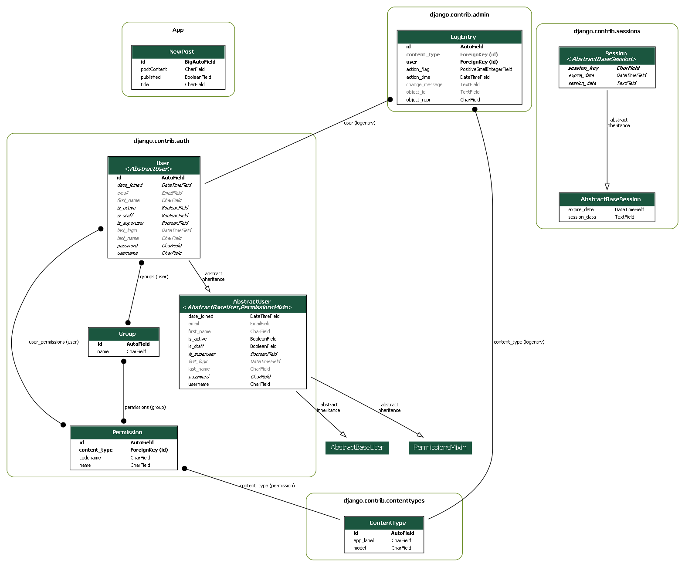

# CraftHub

Backend live [demo](https://crafthub-server.onrender.com/)

## Back install

### install Django server

#### Install Python

- download and install python 3.12.1
  from [Python](https://www.python.org/downloads/)

#### Install the python environment

- clone the repository.
- in CMD
- `cd back`
  (CraftHub\back)
  - `python -m venv venv`
    to create virtual environment
- `cd back`
  (CraftHub\back)
- `python -m venv venv`
  to create virtual environment
- `venv\Scripts\activate`
  to activate virtual environment
- in CMD
- `cd back`
  
- `python -m venv venv`
  to create virtual environment

- to activate virtual environment:
  `venv\Scripts\activate`
  

#### Setup Project inside the virtual environment

- Once inside the environment: 
- `pip install django`
- `python.exe -m pip install --upgrade pip`
  inside the back folder
- `cd CraftHub`
  
- `pip install -r requirements.txt`

#### .env

- inside \back\CraftHub\
- create your .env file

#### run server

- `python manage.py runserver`
- ctrl+click on localhost link.

Note: When finish, to deactivate the environment type:

- `venv\Scripts\deactivate`

## API routes

### Post CRUD

- get-all-posts/  
  GET request, to get all post in the database.
- create-new-post/
  POST request, to create a new post.
- delete-post/  
  DELETE request, to delete a post by "post_id".
- update-post/  
  PUT request, to update a post by "post_id".
- get-post/  
  GET request, to search a post by "post_id".

### users

- search/
  GET request, with query parameter.
  - search/
    to get all users.
  - search/?query={username}
    to get a specific user.

### Registration

- register/
  POST request, to register a new user. payload: {"username","password","email"}

### Login

- login/
  POST request, to login and retrieve access token and refresh token. payload {"username","password"}

### Logout

- logout/
  POST request, to logout. payload {"refresh_token"}

## Database ER diagram

Diagram by Graphivz

