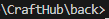
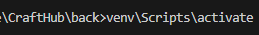
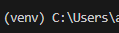
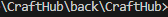

# CraftHub

## Back install

### install server

#### Install Python

- download and install python 3.12.1
  from [Python](https://www.python.org/downloads/)

#### Install the python environment

- clone the repository.
- in CMD
- `cd back`
  
- `python -m venv venv`
  to create virtual environment
- `venv\Scripts\activate`
  
  to activate virtual environment
  

#### Project

- Once inside the environment:
- `pip install django`
- `python.exe -m pip install --upgrade pip`
  inside the back folder
- `cd CraftHub`
  
- `pip install -r requirements.txt`

#### .env

- inside \back\CraftHub\
- create your .env file

#### run server

- `python manage.py runserver`
- ctrl+click on localhost link.

#### to deactivate the environement

- `venv\Scripts\deactivate`
